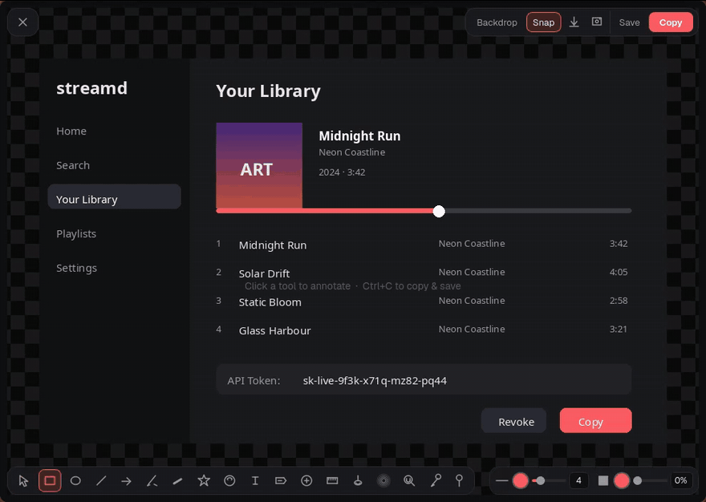
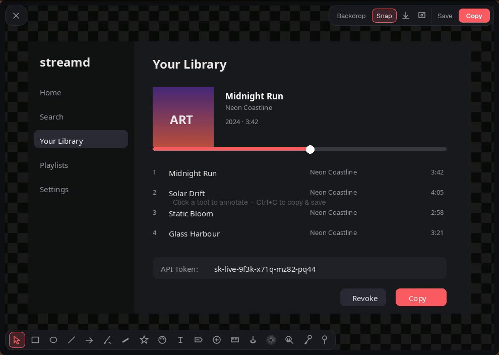
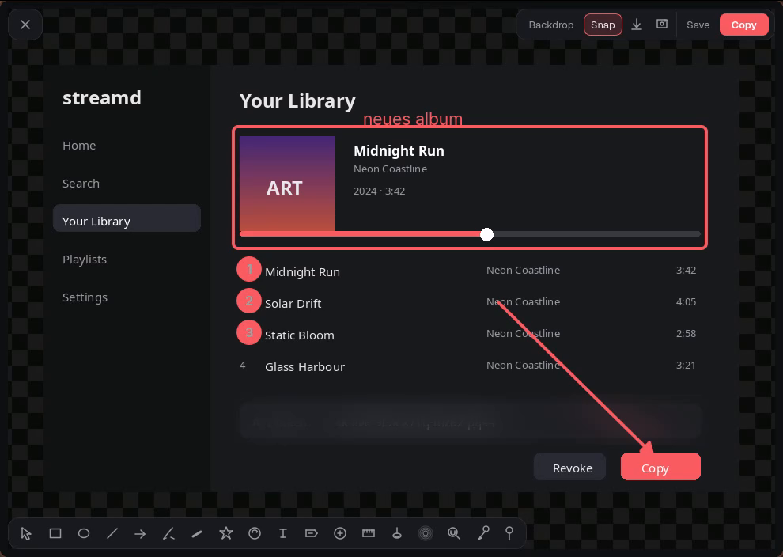

# Captua

> **Vibe-coded with AI.** This project was built almost entirely through conversations with LLMs — it is experimental, opinionated, and may contain rough edges. Contributions and bug reports are welcome!

A fast, lightweight screenshot annotation tool for **Linux / Wayland**.

> ⚠️ **Wayland only** — Captua relies on `grim`, `slurp`, and `wl-clipboard`, which are Wayland-native tools. It will **not** work on X11.

## Features

- **Region capture** via `grim` + `slurp`
- **Full-screen capture** via `grim` (the screen under the cursor)
- **Window capture** on Hyprland (`hyprctl`) and Niri (`niri msg`)
- **Frameless overlay** with `QGraphicsScene` canvas and four floating corner pills (close, actions, tools, properties)
- **Zoom** (mouse wheel) and **pan** (middle-click drag)
- **Self-sizing window** — content + 50px margin, grows with your annotations, always fits the toolbar, capped at the available screen space
- **Single instance** — starting a new capture closes the previous overlay
- **Annotations** — rectangles, circles, arrows, pen, marker, text, labels, emojis, shapes, blur, magnifier, ruler, spotlight, numbering, eyedropper
- **Instant copy** (`Ctrl+C`) — clipboard handoff and auto-save happen in the background, the window closes right away
- **Save** (`Ctrl+S`) with configurable folder and filename template
- **Undo / redo**, layer ordering, drag & drop, paste from clipboard
- **Magnetic snap** — edges and centerlines align automatically while drawing and moving
- **Shift constraints** — hold Shift to force squares, circles, 45° lines, straight strokes
- **Sticky tools** — pin toggle keeps the active tool after drawing
- **Backdrop settings** — padding, colors, gradients, corner radius, angle dial
- **Auto-updater** — checks for new releases on startup and self-updates from the release tarball

## Screenshots



| Fresh capture | Annotated |
|---|---|
|  |  |

## Install

### Quick install (recommended)

Download and run the installer from the latest release:

```bash
curl -fsSL https://github.com/KernicDE/captua/releases/latest/download/install.sh -o install-captua.sh
chmod +x install-captua.sh
./install-captua.sh
```

The installer will:
1. Detect your distro and install `grim`, `slurp`, and `wl-clipboard`
2. Create a Python virtual environment at `~/.local/share/captua/venv`
3. Install Captua and its Python dependencies
4. Place a `captua` launcher in `~/.local/bin/`
5. Install a `.desktop` entry

> Make sure `~/.local/bin` is in your `PATH`.

### From source (for development)

```bash
# Clone
git clone https://github.com/KernicDE/captua.git
cd captua

# Create a venv and install
python3 -m venv .venv
source .venv/bin/activate
pip install -e ".[dev]"

# Run directly from the repo
python3 -m captua.main [--screen | --window]

# Or with logging to /tmp/captua.log
./scripts/debug.sh
```

### System dependencies

If you prefer to install manually, you need:

| Package | Purpose |
|---------|---------|
| `grim` | Screenshot capture |
| `slurp` | Region selection |
| `wl-clipboard` | Clipboard integration |

| Distro | Command |
|--------|---------|
| Arch | `pacman -S grim slurp wl-clipboard` |
| Fedora | `dnf install grim slurp wl-clipboard` |
| openSUSE | `zypper install grim slurp wl-clipboard` |
| Debian / Ubuntu | `apt-get install grim slurp wl-clipboard` |

## Window Manager / Desktop Environment Setup

Captua requests a frameless, always-on-top window. Depending on your compositor you may want to add rules so the overlay floats and is centered.

### Hyprland

Add these window rules to `~/.config/hypr/hyprland.conf`:

```ini
windowrulev2 = float, class:(captua-overlay)
windowrulev2 = center, class:(captua-overlay)
windowrulev2 = noanim, class:(captua-overlay)
```

Note: do not force a size (e.g. `size 80%`) — Captua sizes its window itself to the captured content plus a fixed margin.

### Niri

Add a window rule to `~/.config/niri/config.kdl`:

```kdl
window-rule {
    match app-id="captua-overlay";
    open-floating true;
}
```

Floating is a compositor decision — Captua requests a frameless window sized to the screenshot (content + 50px margin, capped at the available screen space), and the rule above keeps it floating instead of tiled.

Note: a **global** window-rule with `default-window-height` (e.g. `proportion 1.0`) also matches captua-overlay and would force the overlay to full screen height. Captua re-asserts its computed size shortly after opening, which wins over the default — but a matching `default-window-height` in a captua-specific rule would still override it, so don't set one.

### KDE Plasma (KWin)

Create a window rule in *System Settings → Window Management → Window Rules → New*:

| Property | Value |
|---|---|
| Window class | `captua-overlay` |
| Window types | Normal window |
| **Position** | Centered |
| **Window matching** | Exact match |
| **Keep above** | Force → Yes |
| **No border** | Force → Yes |
| **Fullscreen** | Force → No |

Do not force a size — Captua sizes its window itself to the captured content plus a fixed margin.

Or add the rule directly to `~/.config/kwinrulesrc`:

```ini
[captua-overlay]
description=Captua Overlay
clientmachine=localhost
wmclass=captua-overlay
wmclassmatch=1
position=3
above=true
aboverule=3
noborder=true
noborderrule=3
fullscreenrule=2
```

### GNOME (Mutter)

GNOME does not have built-in per-window rules. Captua already requests a frameless, always-on-top window, so it should work out of the box as a regular window.

If you use a tiling extension (e.g. **Pop Shell**, **Forge**, or **Tiling Assistant**), add `captua-overlay` to the floating-windows exception list so it is not tiled.

### Sway

Add to `~/.config/sway/config`:

```
for_window [app_id="captua-overlay"] floating enable, move position center, border none
```

## Set Captua as your default screenshot tool

### Hyprland

Add key bindings to `~/.config/hypr/hyprland.conf`:

```ini
# Region capture
bind = , Print, exec, captua
# Full screen
bind = SHIFT, Print, exec, captua --screen
# Active window
bind = ALT, Print, exec, captua --window
```

### KDE Plasma

1. Open *System Settings → Shortcuts → Custom Shortcuts*
2. Create three new **Global Shortcuts → Command/URL** items:

| Trigger | Command | Shortcut |
|---|---|---|
| Captua Region | `captua` | `Print` |
| Captua Screen | `captua --screen` | `Shift+Print` |
| Captua Window | `captua --window` | `Meta+Print` |

3. Disable or rebind Spectacle's shortcuts so they don't conflict.

### GNOME

1. Open *Settings → Keyboard → Keyboard Shortcuts → Custom Shortcuts*
2. Add three shortcuts:

| Name | Command | Shortcut |
|---|---|---|
| Captua Region | `captua` | `Print` |
| Captua Screen | `captua --screen` | `Shift+Print` |
| Captua Window | `captua --window` | `Alt+Print` |

GNOME's default screenshot shortcuts will conflict — remove or rebind them in the same settings panel.

### Sway

Add to `~/.config/sway/config`:

```
# Region capture
bindsym Print exec captua
# Full screen
bindsym Shift+Print exec captua --screen
# Active window
bindsym $mod+Print exec captua --window
```

## Usage

```bash
# Capture a region (default)
captua

# Capture full screen
captua --screen

# Capture active window (Hyprland / Niri)
captua --window
```

Starting Captua while an overlay is still open closes the old instance automatically.

## Shortcuts

| Key | Action |
|-----|--------|
| `Ctrl + C` | Copy image to clipboard (auto-saves and closes) |
| `Ctrl + S` | Save image to disk |
| `Ctrl + V` | Paste image from clipboard |
| `Ctrl + Z` | Undo |
| `Ctrl + Shift + Z` / `Ctrl + Y` | Redo |
| `?` | Toggle keyboard-shortcut overlay |
| `Wheel` | Zoom |
| `Middle-click drag` | Pan |
| `Delete` / `Backspace` | Remove selected items |
| `PgUp` / `PgDn` | Change layer order |
| `Escape` | Clear text focus → clear selection → close |

See [`docs/GUIDE.md`](docs/GUIDE.md) for the full user guide.

## Tech Stack

- Python 3.11+
- PySide6 (Qt6)
- grim, slurp, wl-clipboard (system deps)

## License

MIT
